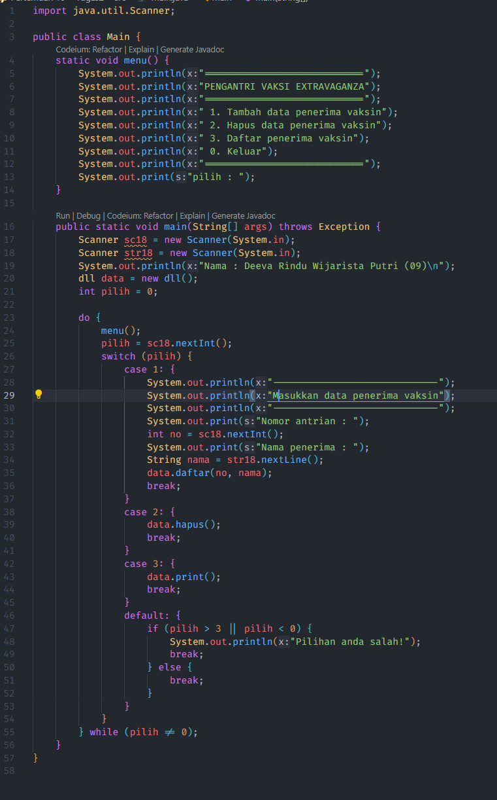
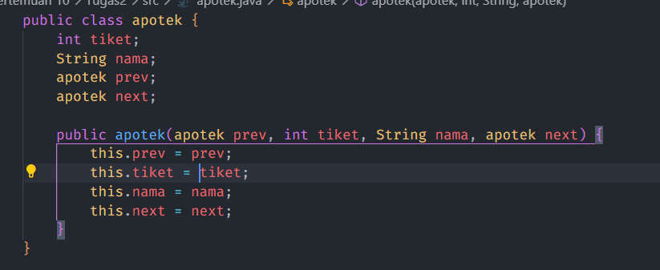

# UTS Praktikum ASD

- Hilman Zahrawa Budiarto
- 2241760051
- SIB 2C

## Praktikum 1

## Pertanyaan

1. Jelaskan perbedaan antara single linked list dengan doubly linked lists!

Jawab:
Single linked list dan doubly linked lists adalah dua jenis linked list. Perbedaan utama antara keduanya adalah bahwa single linked list hanya memiliki satu pointer, yaitu pointer ke node berikutnya, sedangkan doubly linked list memiliki dua pointer, yaitu pointer ke node berikutnya dan pointer ke node sebelumnya.

2. Perhatikan class Node, di dalamnya terdapat atribut next dan prev. Untuk apakah atribut
tersebut?

Jawab:
Atribut next digunakan untuk menyimpan alamat node berikutnya, sedangkan atribut prev digunakan untuk menyimpan alamat node sebelumnya.

3. Perhatikan konstruktor pada class DoublyLinkedList. Apa kegunaan inisialisasi atribut head dan size?

Jawab:
Atribut head digunakan untuk menyimpan alamat node pertama, sedangkan atribut size digunakan untuk menyimpan jumlah node dalam linked list.

4. Pada method addFirst(), mengapa dalam pembuatan objek dari konstruktor class Node prev dianggap sama dengan null?

head = new Node(null, data, null);

Jawab:
Pada method addFirst(), objek dari konstruktor class Node dibuat dengan parameter prev sama dengan null. Hal ini dikarenakan node pertama tidak memiliki node sebelumnya.

5. Perhatikan pada method addFirst(). Apakah arti statement head.prev = newNode?

Jawab:
Statement head.prev = newNode digunakan untuk menghubungkan node pertama dengan node baru.

6. Perhatikan isi method addLast(), apa arti dari pembuatan objek Node dengan mengisikan parameter prev dengan current, dan next dengan null?

Node newNode = new Node(current, data, null);

Jawab:
Pada method addLast(), objek dari konstruktor class Node dibuat dengan parameter prev sama dengan current. Hal ini dikarenakan node baru akan ditempatkan di akhir linked list, sehingga node sebelumnya adalah node yang sedang diproses. Parameter next sama dengan null karena node baru merupakan node terakhir dalam linked list.

7. Pada method add(), terdapat potongan kode program sebagai berikut,

if (current.prev == null) {
    Node newNode = new Node(null, data, current);
    current.prev = newNode;
    head = newNode;
}

## Praktikum 2

## Pertanyaan

1. Apakah maksud statement berikut pada method removeFirst()?

head = head.next;
head.prev = null;

Jawab:
Statement head = head.next digunakan untuk memindahkan pointer head ke node berikutnya. Hal ini dilakukan karena node pertama akan dihapus, sehingga node berikutnya akan menjadi node pertama.

2. Bagaimana cara mendeteksi posisi data ada pada bagian akhir pada method removeLast()?

Jawab:
Untuk mendeteksi posisi data ada pada bagian akhir pada method removeLast(), dapat dilakukan dengan memeriksa nilai dari atribut next pada node terakhir. Jika nilai dari atribut next sama dengan null, maka berarti node tersebut merupakan node terakhir.

3. Jelaskan alasan mengapa potongan kode program di bawah ini tidak cocok untuk perintah remove!

Node tmp = head.next;
head.next = tmp.next;
tmp.next.prev = head;

Jawab:
Potongan kode program tersebut tidak cocok untuk perintah remove karena tidak menghapus data dari linked list. Potongan kode program tersebut hanya memindahkan pointer head ke node berikutnya.

4. Jelaskan fungsi kode program berikut ini pada fungsi remove!

current.prev.next = current.next;
current.next.prev = current.prev;

Jawab:
Kode program current.prev.next = current.next; digunakan untuk menghubungkan node sebelumnya dengan node berikutnya.

Kode program current.next.prev = current.prev; digunakan untuk menghubungkan node berikutnya dengan node sebelumnya.

Kode program tersebut digunakan untuk menghapus node yang sedang diproses dari linked list.

## Praktikum 3

## Pertanyaan

1. Jelaskan method size() pada class DoublyLinkedList!

Jawab:
Method size() pada class DoublyLinkedList digunakan untuk mengembalikan jumlah node dalam linked list. Method ini dapat diimplementasikan dengan menggunakan variabel size yang menyimpan jumlah node dalam linked list.

2. Jelaskan cara mengatur indeks pada doubly linked lists supaya dapat dimulai dari indeks ke-1!

Jawab:
Untuk mengatur indeks pada doubly linked lists supaya dapat dimulai dari indeks ke-1, dapat dilakukan dengan cara menambahkan sebuah atribut index pada class Node. Atribut index digunakan untuk menyimpan indeks dari node tersebut.

3. Jelaskan perbedaan karakteristik fungsi Add pada doubly linked list dan single linked list!

Jawab:
Pada doubly linked list, fungsi Add dapat digunakan untuk menambahkan node di awal, di tengah, atau di akhir linked list. Hal ini dikarenakan doubly linked list memiliki dua pointer, yaitu pointer ke node berikutnya dan pointer ke node sebelumnya.

Pada single linked list, fungsi Add hanya dapat digunakan untuk menambahkan node di awal atau di akhir linked list. Hal ini dikarenakan single linked list hanya memiliki satu pointer, yaitu pointer ke node berikutnya.

4. Jelaskan perbedaan logika dari kedua kode program di bawah ini!
Kode 1
public boolean isEmpty() {
    if(size==0) {
        return true;
    } else {
        return false;
    }
}
Kode 2
public boolean isEmpty() {
    return head == null;
}

Jawab:
Kode 1 menggunakan logika if-else untuk memeriksa apakah ukuran linked list sama dengan 0. Jika ya, maka linked list kosong. Jika tidak, maka linked list tidak kosong.

Kode 2 menggunakan logika return untuk memeriksa apakah pointer head sama dengan null. Jika ya, maka linked list kosong. Jika tidak, maka linked list tidak kosong.

Pada dasarnya, kedua kode program tersebut memiliki logika yang sama, yaitu untuk memeriksa apakah linked list kosong. Perbedaannya adalah pada cara pemeriksaannya

## Tugas 1

 

