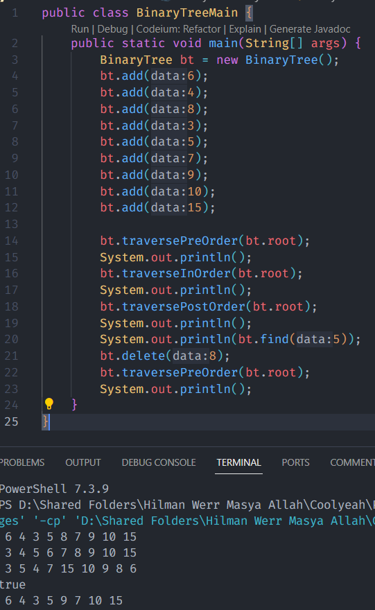

# Praktikum ASD

- Hilman Zahrawa Budiarto
- 2241760051
- SIB 2C

## Praktikum 1

## Pertanyaan

1. Mengapa dalam binary search tree proses pencarian data bisa lebih efektif dilakukan dibanding binary tree biasa?

Jawab:
Binary search tree memungkinkan pencarian data lebih efisien karena mengatur data secara terurut dalam pohon, memungkinkan penggunaan algoritma pencarian biner dengan kompleksitas logaritmik, sementara binary tree biasa tidak memiliki aturan urutan, mengharuskan pencarian linear yang lebih lambat.

2. Apa fungsi atribut left dan right pada class Node?

Jawab:
Atribut "left" dan "right" pada class Node dalam binary tree digunakan untuk menunjukkan node-node anak dari node saat ini. "left" mengacu pada anak sebelah kiri, sementara "right" mengacu pada anak sebelah kanan, memungkinkan pembentukan struktur hirarki dalam pohon biner.

Simak pertanyaan berikut,
4. Apa kegunaan dari atribut root di dalam class BinaryTree?

Jawab:
Atribut "root" dalam class BinaryTree digunakan untuk menunjukkan node pertama atau akar dari pohon biner. Ini adalah titik awal dari pohon dan memungkinkan akses ke seluruh struktur pohon dengan mengikuti pointer "left" dan "right", serta melakukan operasi seperti pencarian, penambahan, atau penghapusan data dalam pohon.

5. Ketika objek tree pertama kali dibuat, apa nilai dari root?

Jawab:
Ketika objek tree pertama kali dibuat, nilai dari atribut "root" biasanya diatur sebagai null. Ini menunjukkan bahwa pohon awalnya kosong, karena belum ada node yang ditambahkan ke dalamnya.

6. Ketika tree masih kosong, dan akan ditambahkan sebuah node baru, proses apa yang akan terjadi?

Jawab:
Ketika tree masih kosong dan akan ditambahkan sebuah node baru, proses yang terjadi adalah membuat node baru dan mengaturnya sebagai akar (root) dari pohon. Dengan kata lain, node baru tersebut akan menjadi node pertama dalam pohon karena pohon sebelumnya kosong.

7. Perhatikan method add(), di dalamnya terdapat baris program seperti di bawah ini. Jelaskan secara detil untuk apa baris program tersebut?

if(data < current.data) {
    if(current.left != null) {
        current = current.left;
    } else {
        current.left = new Node(data);
        break;
    }
}

Jawab:
Kode tersebut adalah bagian dari metode "add()" yang digunakan untuk menambahkan node baru ke dalam pohon biner. 

a. `if(data < current.data)`: Ini adalah kondisi yang memeriksa apakah nilai yang akan ditambahkan (`data`) lebih kecil daripada nilai pada node saat ini (`current.data`). Jika kondisi ini benar, itu berarti kita harus menambahkan node baru ke subpohon kiri.

b. `if(current.left != null)`: Ini adalah kondisi yang memeriksa apakah subpohon kiri dari node saat ini (`current.left`) tidak kosong. Jika subpohon kiri sudah ada, itu berarti kita harus melanjutkan pencarian dan pindah ke node sebelah kiri.

c. `current = current.left;`: Jika subpohon kiri sudah ada, kita pindah ke node sebelah kiri (`current.left`) dan melanjutkan pencarian untuk menemukan tempat yang tepat untuk menambahkan node baru.

d. `else { current.left = new Node(data); break; }`: Jika subpohon kiri kosong, itu berarti kita telah menemukan tempat yang tepat untuk menambahkan node baru. Kami membuat node baru dengan nilai `data` dan mengaturnya sebagai anak kiri dari node saat ini (`current.left`). Kemudian, pernyataan `break` digunakan untuk menghentikan iterasi karena node baru telah ditambahkan ke dalam pohon.
