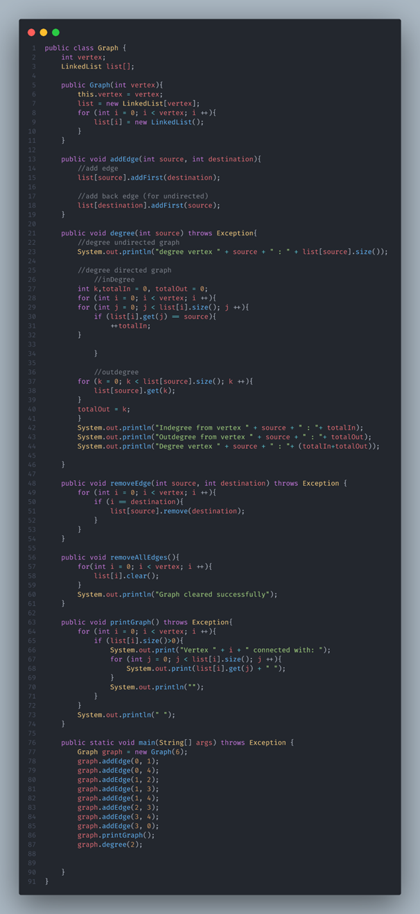
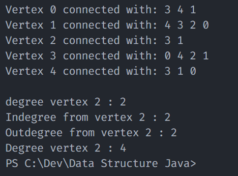

# Praktikum ASD

- Hilman Zahrawa Budiarto
- 2241760051
- SIB 2C

## Praktikum 1

## Pertanyaan
1. Sebutkan beberapa jenis (minimal 3) algoritma yang menggunakan dasar Graph, dan apakah kegunaan algoritma-algoritma tersebut?

Jawab:
Tiga jenis algoritma yang menggunakan dasar-dasar Graf adalah:
a) Breadth-First Search (BFS): Algoritma ini menjelajahi semua simpul graf secara berurutan, dimulai dari simpul sumber yang diberikan. Ini umumnya digunakan untuk menemukan lintasan terpendek atau untuk menjelajahi dan mengunjungi semua komponen terhubung dari graf tak berarah.

b) Depth-First Search (DFS): Algoritma ini menjelajahi semua simpul graf secara berurutan, dimulai dari simpul sumber yang diberikan. Digunakan untuk menjelajahi dan mengunjungi semua komponen terhubung dari graf, mendeteksi siklus, dan melakukan berbagai operasi terkait graf.

c) Algoritma Dijkstra: Algoritma ini menemukan lintasan terpendek antara simpul sumber yang diberikan dan semua simpul lainnya dalam graf berbobot. Ini banyak digunakan dalam protokol routing jaringan, sistem navigasi GPS, dan berbagai masalah optimasi.

2. Pada class Graph terdapat array bertipe LinkedList, yaitu LinkedList list[]. Apakah tujuan pembuatan variabel tersebut ?

Jawab:
Digunakan untuk merepresentasikan representasi daftar kejadian dari suatu graf. Setiap indeks dari array list[] sesuai dengan suatu simpul dalam graf, dan LinkedList di indeks tersebut menyimpan simpul-simpul terhubung dari simpul tersebut. Struktur data ini memungkinkan penyimpanan dan pengambilan simpul terhubung secara efisien untuk setiap simpul dalam graf.

3. Apakah alasan pemanggilan method addFirst() untuk menambahkan data, bukan method add jenis lain pada linked list ketika digunakan pada method addEdge pada class Graph?

Jawab:
Ketika menggunakan metode addEdge() dalam kelas Graf, tujuannya adalah untuk mempertahankan urutan dari daftar kejadian. Dengan menambahkan simpul baru di awal daftar, kita memastikan bahwa simpul yang baru ditambahkan menjadi simpul terhubung pertama untuk simpul sumber. Urutan ini penting untuk merepresentasikan tepi dalam graf dan untuk menjaga konsistensi saat melakukan operasi terkait graf.

4. Bagaimana cara mendeteksi prev pointer pada saat akan melakukan penghapusan suatu edge pada graph ?

Jawab:
Dapat terdeteksi dengan menjelajahi daftar dan membandingkan nilai simpul. Dalam kode yang diberikan, metode removeEdge() melooping melalui daftar kejadian simpul dan memeriksa apakah simpul tujuan cocok dengan nilai yang dihapus. Begitu cocok ditemukan, pointer prev dapat ditentukan dengan melacak simpul sebelumnya saat menjelajahi linked list.

5. Kenapa pada praktikum 12.2 langkah ke-12 untuk menghapus path yang bukan merupakan lintasan pertama kali menghasilkan output yang salah ? Bagaimana solusinya ?

Jawab:
Pada Praktikum 1.2, menghapus jalur yang bukan jalur pertama mungkin menghasilkan keluaran yang salah karena kode mengasumsikan bahwa hanya ada satu jalur antara dua simpul. Jika ada beberapa jalur antara sepasang simpul yang sama, menghapus jalur yang bukan jalur pertama akan menghapus salah satu tepi yang valid, yang dapat mengubah keterhubungan graf dan menghasilkan hasil yang salah.

Untuk mengatasi masalah ini, daripada menghapus tepi secara langsung menggunakan removeEdge() untuk jalur kedua, Anda dapat memodifikasi metode removeEdge() untuk menghapus semua kemunculan tepi antara simpul sumber dan tujuan. Dengan cara ini, semua jalur antara dua simpul akan dihapus, memastikan konsistensi dalam keterhubungan graf.

## Praktikum 2

## Pertanyaan

1. Apakah perbedaan degree/derajat pada directed dan undirected graph?

Jawab:
Perbedaan derajat antara graf berarah dan graf tak berarah terletak pada cara tepi diperlakukan. Pada graf tak berarah, setiap tepi mewakili koneksi dua simpul yang dapat dilalui dua arah, dan derajat suatu simpul adalah jumlah tepi yang terhubung kepadanya. Pada graf berarah, tepi memiliki arah tertentu, yang berarti mereka mewakili koneksi satu arah dari satu simpul ke simpul lain. Dalam hal ini, derajat suatu simpul dibagi menjadi derajat masuk (jumlah tepi masuk) dan derajat keluar (jumlah tepi keluar).

2. Pada implementasi graph menggunakan adjacency matriks. Kenapa jumlah vertices harus ditambahkan dengan 1 pada indeks array berikut?

Jawab:
Jumlah simpul ditambahkan 1 pada indeks array karena indeks array dalam Java (dan banyak bahasa pemrograman lainnya) dimulai dari 0. Dengan menambahkan 1 pada jumlah simpul, implementasi mengalokasikan baris dan kolom tambahan dalam array dua dimensi untuk menampung penomoran simpul dari 1 hingga 'simpul'. Ini dilakukan untuk menyederhanakan pengindeksan dan menghindari kebingungan antara nomor simpul dan indeks array.

3. Apakah kegunaan method getEdge() ?

Jawab:
Metode getEdge() digunakan untuk mengambil nilai (atau bobot) dari tepi antara dua simpul dalam graf. Metode ini menerima dua parameter: simpul 'ke' dan simpul 'dari'. Pertama, metode ini memeriksa apakah indeks simpul yang diberikan berada dalam rentang yang valid dari matriks kejadian. Jika iya, metode ini mengembalikan nilai yang disimpan di sel yang sesuai dalam array dua dimensi. Jika indeks simpul berada di luar batas, metode ini mencetak pesan kesalahan dan mengembalikan -1 (sebuah nilai penanda mungkin untuk menunjukkan kesalahan).

4. Termasuk jenis graph apakah uji coba pada praktikum 12.3 ?

Jawab:
Berdasarkan kode, tampaknya sedang mengimplementasikan graf tak berarah karena metode makeEdge() tidak membedakan antara simpul 'ke' dan simpul 'dari'. Tepi disimpan secara dua arah, menunjukkan koneksi tak berarah.

5. Mengapa pada method main harus menggunakan try-catch Exception ?

Jawab:
Metode utama menggunakan blok try-catch dengan tangkapan Exception umum untuk menangani kemungkinan kesalahan atau pengecualian yang mungkin terjadi selama runtime. Dengan melibatkan kode dalam blok try, program mencoba mengeksekusi kode secara normal. Jika pengecualian terjadi, blok catch akan menangkap pengecualian dan menanganinya. Ini mencegah program berakhir tiba-tiba dan memberikan cara yang lebih ramah untuk menampilkan pesan kesalahan kepada pengguna.

## Tugas Praktikum

1. Ubahlah lintasan pada praktikum 12.2 menjadi inputan!

2. Tambahkan method graphType dengan tipe boolean yang akan membedakan graph termasuk directed atau undirected graph. Kemudian update seluruh method yang berelasi dengan method graphType tersebut (hanya menjalankan statement sesuai dengan jenis graph) pada praktikum 12.2

3. Modifikasi method removeEdge() pada praktikum 12.2 agar tidak menghasilkan output yang salah untuk path selain path pertama kali!

4. Ubahlah tipe data vertex pada seluruh graph pada praktikum 12.2 dan 12.3 dari Integer menjadi tipe generic agar dapat menerima semua tipe data dasar Java! Misalnya setiap vertex yang awalnya berupa angka 0,1,2,3, dst. selanjutnya ubah menjadi suatu nama daerah seperti Malang, Surabaya, Gresik, Bandung, dst.

